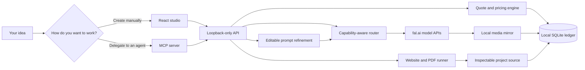
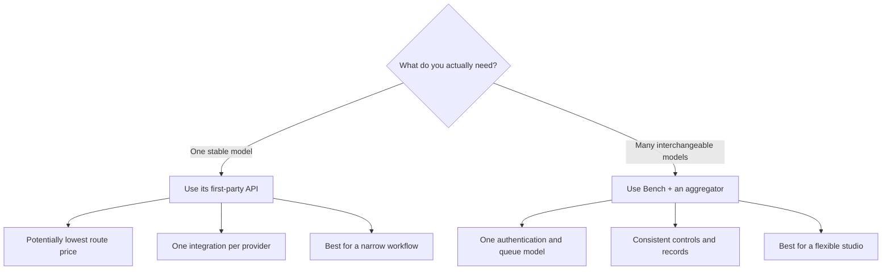
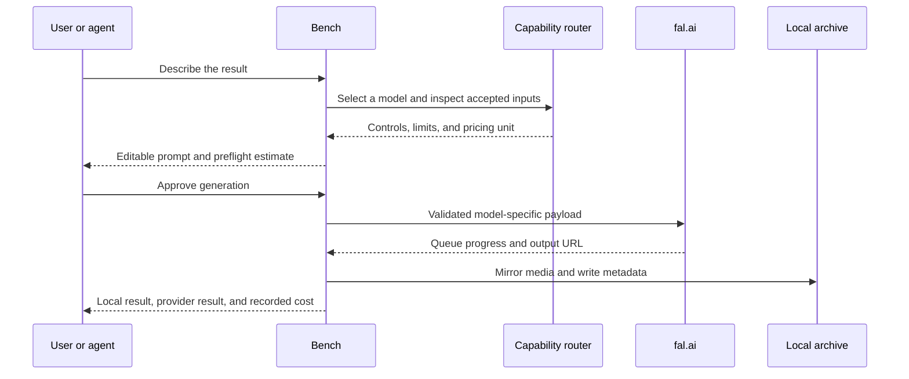
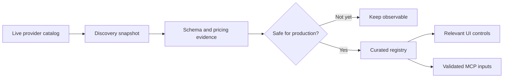
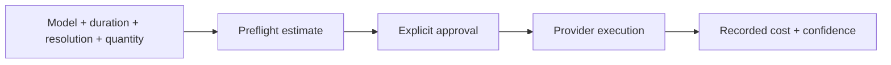
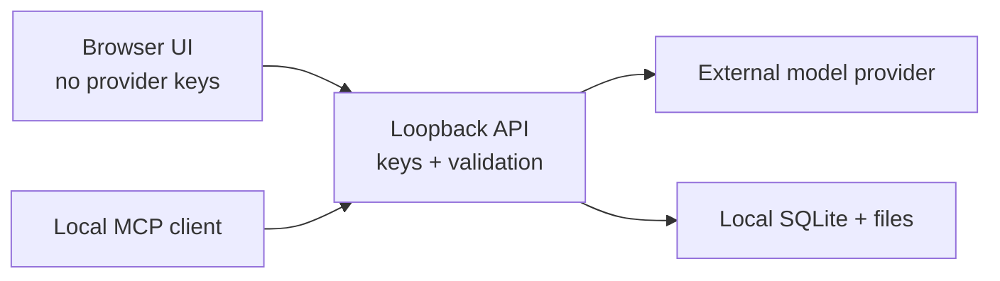

<div align="center">

# Bench Studio

### Stop renting the wrapper. Own the creative layer.

A local-first creative studio for images, videos, websites, designed PDFs, and AI-agent workflows.

[](LICENSE)


**[Quick start](#run-it-in-three-minutes)** · **[How it works](#the-system-in-30-seconds)** · **[Connect an agent](#use-it-from-claude-codex-or-cursor)** · **[Security](SECURITY.md)**

</div>


Bench Studio puts **37 curated image and video routes**, prompt refinement,
capability-aware controls, local file custody, and a transparent cost ledger
behind one interface. The same system is available to Claude, Codex, Cursor,
and other compatible clients through MCP.

Your keys stay server-side on your machine. Your prompts are editable before
you spend. Your outputs are mirrored locally. Your costs are recorded in real
units instead of disappearing into mystery credits.

> [!NOTE]
> This is the sanitized public distribution. It ships with no generation
> history, uploads, private database, personal paths, credentials, or local
> build artifacts. Your archive begins empty.

## Why this exists

Most creative AI products combine five useful pieces—model access, prompt
polish, routing, storage, and billing—then hide the seams behind a monthly plan.
Bench keeps the convenience while making every seam inspectable.

| Instead of… | Bench gives you… |
| --- | --- |
| One provider's model roadmap | A curated registry you can add to or replace |
| A generic upload box | Controls derived from each endpoint's accepted inputs |
| An invisible prompt rewrite | An editable model-specific draft before submission |
| Abstract credits | A preflight estimate and recorded spend metadata |
| Outputs trapped in an account gallery | Local mirrored files and durable metadata |
| A UI-only workflow | The same capabilities through the UI and MCP |
| Waiting for the next feature | Source you can inspect, change, and extend |

Bench does **not** own the underlying models. It gives you ownership of the
portable layer that connects your ideas, tools, providers, files, and costs.

## Run it in three minutes

### What you need

- Node.js **22.5+**; Node 24 is recommended because Bench uses `node:sqlite`.
- npm.
- A [fal.ai](https://fal.ai/) API key for image and video generation.
- Google Chrome for PDF printing and visual preflight.
- Optional: a Google API key for prompt refinement.
- Optional: a signed-in Codex installation for website and document builds.

### 1. Clone and install

```bash
git clone https://github.com/promptadvisers/bench-studio-public.git
cd bench-studio-public
npm install
```

### 2. Add server-side credentials

Bench reads credentials from `~/.env`. Never put provider keys in Vite
variables or commit them to the repository.

```dotenv
FAL_KEY=<your-fal-key>
GOOGLE_API_KEY=<your-optional-google-key>
```

`FAL_KEY` is required for media generation. Without `GOOGLE_API_KEY`, Bench
still runs and submits your original prompt without refinement.

### 3. Start the studio

```bash
npm run dev
```

Open **[http://localhost:5200](http://localhost:5200)**.

| Service | Address |
| --- | --- |
| Studio | `http://localhost:5200` |
| Local API | `http://localhost:8787` |
| Health and capability summary | `http://localhost:8787/api/health` |

If either port is occupied:

```bash
PORT=8790 BENCH_API_PORT=8790 BENCH_WEB_PORT=5201 npm run dev
```

## What you can make

| Workspace | What it delivers |
| --- | --- |
| **Create** | Images and videos with model-aware references, controls, editable prompt drafts, quotes, progress, and inline results. |
| **Model catalog** | Curated text-to-image, image-editing, text-to-video, image-to-video, and reference-video routes. |
| **Results** | A local archive containing the submitted prompt, model, provider URL, local file, and recorded cost. |
| **Websites** | Original static sites with editable source, a local preview, and a downloadable bundle. |
| **Documents** | Designed PDFs backed by editable HTML, Chromium printing, and overflow preflight. |
| **Connect** | Machine-correct MCP configuration and a portable skill for compatible agents. |


## The system in 30 seconds



The browser never receives provider secrets. It talks to a local service that
validates model-specific payloads, owns credentials, streams progress, mirrors
artifacts, and records durable metadata.

## Choose the right connection strategy

Bench uses an aggregator because one authentication and queue model is the
practical way to support a large, interchangeable catalog. That is not the
only valid architecture.



An aggregator may not always be the cheapest route. Bench makes that tradeoff
explicit instead of calling it “zero markup.”

## One request, from idea to receipt



Bench records what was submitted. It never claims an attached reference
influenced an output merely because an API accepted the field; creative
fidelity still requires human review.

## Model intelligence, not a dropdown full of URLs

Every endpoint has different assumptions. Some accept one image, some accept a
list, some require a start frame, and others accept no references. Bench keeps
discovery separate from production admission:



This prevents a newly published, renamed, or underspecified model from silently
breaking a paid workflow.

## Prompt refinement stays visible

1. Write a normal creative request.
2. Bench adds the structure the selected model is likely to understand.
3. Review the rewritten prompt as an editable draft.
4. Change or reject it before spending anything.
5. Store the final submitted prompt with the result.

If no Google key is configured, the original prompt passes through unchanged
and the interface reports that refinement is disabled.

## Cost transparency without marketing math

Before submission, Bench estimates cost from the model's pricing unit and the
requested parameters. After completion, it records the billed amount when the
provider exposes sufficient receipt data.



Pricing changes. Estimates are not guarantees. Bench distinguishes estimated,
metered, and recorded values instead of presenting all three as the same fact.

## Your local data boundary

The repository starts with no `data/` directory. Bench creates it on first run:

```text
data/
├── bench.db              # generations, assets, spend, and projects
├── inputs/               # mirrored uploads
├── outputs/              # mirrored generations
├── previews/             # local video posters
└── projects/             # website and document source files
```

The entire directory is ignored by Git. Deleting a result removes its local
database record and mirrored files. It does not claim to delete copies retained
by an external model provider.



## Use it from Claude, Codex, or Cursor

Start Bench, open **Connect**, choose your client, and copy the generated
configuration. Bench inserts the correct absolute path for the current machine;
the repository itself ships with no user's home directory.

The MCP server exposes eleven focused tools for:

- discovering models and inspecting capability contracts;
- uploading local reference media;
- generating images and videos;
- reading results, previews, and spend;
- creating and polling website or document projects;
- retrieving local project artifacts.

The bundled skill in `integrations/skills/bench-studio/` provides judgment and
workflow guidance. MCP provides the live execution layer.

## Project map

```text
bench-studio-public/
├── src/                     # React interface
├── server/
│   ├── server.mjs           # loopback API and orchestration
│   ├── mcp.mjs              # stdio MCP server
│   ├── registry.json        # curated production roster
│   ├── capabilities.json    # accepted-input contracts
│   ├── profiles/            # prompt and pricing intelligence
│   └── mcp-app/             # embedded MCP interface
├── integrations/
│   ├── skills/bench-studio/ # portable agent workflow skill
│   └── macos/               # optional launch-agent templates
├── tests/                   # contracts, persistence, API, a11y, and E2E
├── docs/                    # public README media
├── .env.example             # placeholders only
└── package.json
```

## Useful commands

| Command | Purpose |
| --- | --- |
| `npm run dev` | Start the local API and web interface. |
| `npm run build` | Build the production web application. |
| `npm run registry` | Rebuild the curated model registry. |
| `npm run capabilities` | Rebuild the capability manifest. |
| `npm run catalog:sync` | Refresh provider discovery and pricing evidence. |
| `npm run mcp` | Start the stdio MCP server. |
| `npm run test:contracts` | Run API, persistence, and model-contract tests. |
| `npm run test:mcp` | Smoke-test MCP discovery and media behavior. |
| `npm run test:e2e` | Run browser journeys and accessibility checks. |
| `npm run test:release` | Run the complete release gate. |

## Security and privacy

- The API binds to loopback by default. Do not expose it publicly without
  authentication and a deliberate threat model.
- Secrets are read server-side from `~/.env` and are never returned to the UI.
- `.env*` is ignored except for the placeholder-only `.env.example`.
- Local data, reports, generated builds, test output, and handoffs are ignored.
- Generated media may still be retained by an external provider according to
  that provider's terms.
- Website and document creation can invoke a locally authenticated coding
  agent. Review generated source before deploying it.

Read [SECURITY.md](SECURITY.md) before exposing, modifying, or redistributing
the service.

## Honest boundaries

- Bench is a local, single-user tool—not a hosted multi-tenant SaaS product.
- The registry is curated intentionally; catalog presence does not guarantee
  production admission.
- Accepted inputs do not guarantee creative fidelity.
- Website output is static by design.
- PDF creation depends on a local Chrome installation.
- Model availability and pricing can change after a catalog sync.
- Owning the layer means maintaining a small piece of software.

## Release confidence

The release gate covers production builds, API and database contracts, MCP
discovery, browser journeys, accessibility, responsive containment, failure
states, model transitions, and visual snapshots.

```bash
npm run test:release
```

## License

Bench Studio Public is available under the [MIT License](LICENSE).

---

<div align="center">

**The models do the heavy lifting. Bench makes the layer around them visible—and yours.**

</div>
