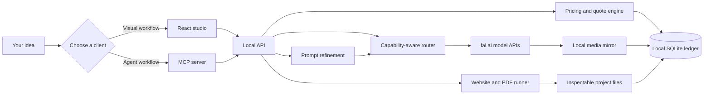
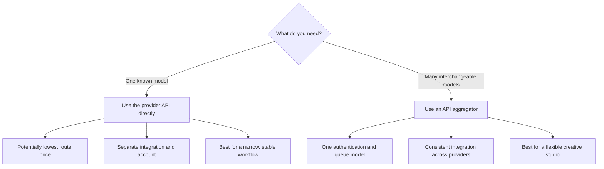
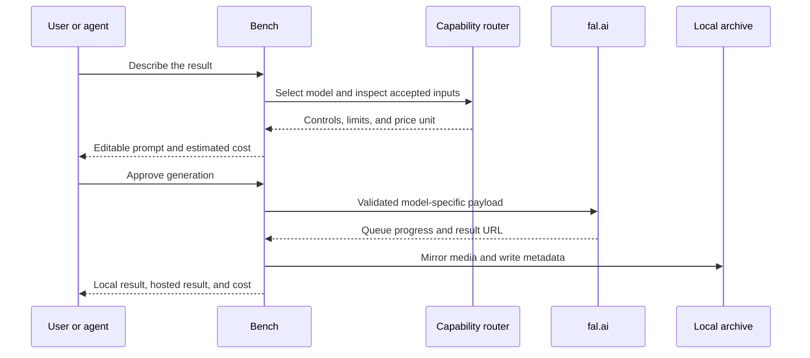
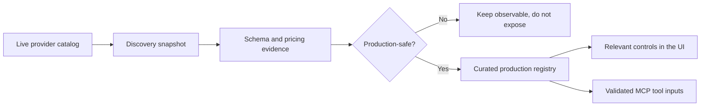
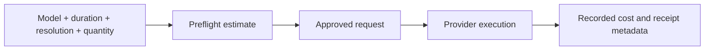

# Bench Studio Public

### Own the creative layer between an idea and the model that makes it.

Bench Studio is a local-first creative workspace for generating images and
videos, building websites, producing designed PDFs, and giving AI agents the
same tools through MCP.

It replaces the mystery-credit experience with something inspectable: the
model, submitted prompt, accepted inputs, output files, and cost are recorded
for every generation. Your API keys stay on your machine. Your local archive
starts empty and remains under your control.

> This is the sanitized public distribution. It contains no generation
> history, uploaded media, private database, personal paths, cached credentials,
> project handoffs, or local build artifacts.

## The promise

One interface should not mean one opaque provider.

Bench gives you a consistent creative workflow while preserving the details
that matter:

- **37 curated model routes** across image and video workflows;
- **model-aware controls** derived from endpoint capability contracts;
- **editable prompt refinement** before a paid request is submitted;
- **transparent estimates and recorded spend** instead of abstract credits;
- **local mirroring** of inputs, outputs, metadata, websites, and documents;
- **MCP access** for Claude, Codex, Cursor, and compatible clients;
- **source-ownable workflows** that can be extended when a feature is missing.

## See the whole system in 30 seconds



The browser never receives provider secrets. It talks to a loopback-only
service that validates requests, owns credentials, streams progress, mirrors
artifacts, and records durable metadata.

## Pick the connection strategy that fits you

The application uses an aggregator because that is the practical route for a
large model catalog. You can still use this mental model when deciding how to
build your own routes.



Bench chooses the second path. The tradeoff is explicit: an aggregator may not
always be the cheapest possible route, but it dramatically reduces the work
required to support many models safely.

## What you can make

| Workspace | What it delivers |
| --- | --- |
| **Create** | Images and videos with model-aware references, controls, prompt drafts, quotes, progress, and inline results. |
| **Models** | A curated catalog organized by text-to-image, image editing, text-to-video, image-to-video, and reference-video lanes. |
| **Results** | A local media archive with the submitted prompt, model, mode, provider URL, local file, and recorded cost. |
| **Websites** | Original static sites with editable `index.html`, `styles.css`, and `app.js`, plus a local preview and source bundle. |
| **Documents** | Designed PDFs with editable HTML, Chromium printing, and overflow preflight. |
| **Connect** | Machine-correct MCP configuration and a downloadable skill for compatible agents. |

## The generation lifecycle



Bench does not claim a reference influenced an output merely because an API
accepted the field. It records what was submitted and leaves visual judgment to
the reviewer.

## Quick start

### Requirements

- Node.js **22.5+**. Node 24 is recommended because Bench uses `node:sqlite`.
- npm.
- A [fal.ai](https://fal.ai/) API key for image and video generation.
- Google Chrome for PDF printing and visual preflight.
- Optional: a Google API key for prompt refinement.
- Optional: a signed-in Codex installation for website and document builds.

### 1. Install

```bash
git clone https://github.com/promptadvisers/bench-studio-public.git
cd bench-studio-public
npm install
```

### 2. Configure credentials

Bench reads server-side credentials from `~/.env`. Do not put API keys in Vite
variables or commit them to the repository.

Create `~/.env` if it does not exist, then add these values without overwriting
any credentials already stored there:

```dotenv
FAL_KEY=<your-fal-key>
GOOGLE_API_KEY=<your-optional-google-key>
```

`FAL_KEY` is required for media generation. Without `GOOGLE_API_KEY`, Bench
still runs and submits the prompt as written.

### 3. Start

```bash
npm run dev
```

| Service | Address |
| --- | --- |
| Studio | [http://localhost:5200](http://localhost:5200) |
| API health | [http://localhost:8787/api/health](http://localhost:8787/api/health) |
| Backend | `http://localhost:8787` |

The browser uses same-origin paths. Vite proxies `/api`, `/media`, and
`/projects` to the local backend.

If those ports are occupied, choose another pair:

```bash
PORT=8790 BENCH_API_PORT=8790 BENCH_WEB_PORT=5201 npm run dev
```

### 4. Verify

```bash
curl http://localhost:8787/api/health
```

The health response reports model count, pricing coverage, catalog sync state,
SQLite status, mirrored assets, and whether prompt refinement is enabled.

## How model intelligence works

Every endpoint has different assumptions. Some accept one image, some accept a
list, some need a start frame, and others support no references at all. A single
generic upload field is not enough.

Bench separates discovery from production admission:



This keeps a newly published, renamed, or underspecified model from silently
breaking a paid workflow.

## Prompt refinement is visible

Prompt refinement is an optional layer, not a hidden requirement.

1. You write a normal creative request.
2. Bench adds model-specific structure for the chosen endpoint.
3. The result is shown as an editable draft.
4. You can change it before spending anything.
5. The final submitted prompt is stored with the result.

If no Google key is configured, the original prompt passes through unchanged
and the interface says the rewriter is disabled.

## Cost transparency

Before a request, Bench shows a quote based on the endpoint's current pricing
unit. After completion, the ledger stores the generation record and billed
amount when the provider exposes it.

Pricing changes. Estimates are not guarantees. The interface distinguishes
estimated, metered, and recorded values rather than turning all three into a
single marketing number.



## Local data boundary

The public repository begins with no `data/` directory. Bench creates it on
first run.

```text
data/
├── bench.db              # SQLite records
├── inputs/               # mirrored uploads
├── outputs/              # mirrored generations
├── previews/             # local video posters
└── projects/             # website and document source files
```

The entire directory is ignored by Git. Deleting a result from Bench removes
its local database record and mirrored files. It does not claim to delete a
copy retained by an external model provider.

## Use it from Claude, Codex, or Cursor

Start Bench, open **Connect**, and copy the generated configuration for your
client. The command contains the correct absolute path for the current machine,
so the repository does not ship anyone else's home directory.

The MCP surface includes tools to:

- list models and inspect exact capability contracts;
- upload local media;
- generate images and videos;
- inspect results and usage;
- create and poll website or document projects;
- retrieve local artifacts.

The bundled skill at `integrations/skills/bench-studio/` teaches an agent how to
use those tools responsibly. The skill is workflow guidance; MCP is the actual
execution layer.

## Useful commands

| Command | Purpose |
| --- | --- |
| `npm run dev` | Start the API and web interface together. |
| `npm run build` | Build the production web application. |
| `npm run registry` | Rebuild the curated model registry. |
| `npm run capabilities` | Rebuild the capability manifest. |
| `npm run catalog:sync` | Refresh discovery and pricing evidence. |
| `npm run mcp` | Start the stdio MCP server. |
| `npm run test:contracts` | Run API, database, and contract tests. |
| `npm run test:mcp` | Smoke-test the MCP surface. |
| `npm run test:e2e` | Run browser journeys and accessibility checks. |
| `npm run test:release` | Run the complete release gate. |

## Project map

```text
bench-studio-public/
├── src/                     # React interface
├── server/
│   ├── server.mjs           # loopback API and generation orchestration
│   ├── mcp.mjs              # stdio MCP server
│   ├── registry.json        # curated production roster
│   ├── capabilities.json    # model input contracts
│   ├── profiles/            # prompt and pricing profiles
│   └── mcp-app/             # embedded MCP interface
├── integrations/
│   ├── skills/bench-studio/ # installable agent workflow skill
│   └── macos/               # optional launch-agent templates
├── tests/                   # contracts, persistence, API, a11y, and E2E
├── .env.example             # placeholders only
└── package.json
```

## Release confidence

The release gate covers:

- production builds for the web interface and MCP app;
- API, database, and persistence contracts;
- MCP tool discovery and inline-media behavior;
- desktop and mobile browser journeys;
- accessibility checks;
- responsive containment;
- provider failure states and model transitions;
- visual regression snapshots.

Run it before publishing changes:

```bash
npm run test:release
```

## Security and privacy

- The API binds to loopback by default. Do not expose it publicly without
  authentication and a deliberate threat model.
- Secrets are read server-side from `~/.env` and are never returned to the UI.
- `.env*` is ignored except for the placeholder-only `.env.example`.
- `data/`, reports, build artifacts, and handoffs are ignored.
- Generated media may still be retained by the external provider according to
  its terms.
- Website and document building can invoke a locally authenticated coding
  agent. Review generated source before deploying it.

See [SECURITY.md](SECURITY.md) before exposing or redistributing the service.

## Boundaries worth knowing

- Bench is a local single-user tool, not a hosted multi-tenant SaaS product.
- The production registry is curated intentionally; catalog presence alone is
  not enough for admission.
- Provider schemas describe accepted inputs, not guaranteed creative fidelity.
- Website output is static by design.
- PDF creation depends on a local Chrome installation.
- Prices and model availability can change after a catalog sync.

## Philosophy

The models do the heavy lifting. The valuable layer is the part that makes them
usable: selection, prompt treatment, safe routing, storage, cost visibility,
and connection to the tools where you already work.

Bench makes that layer inspectable and yours to change.
